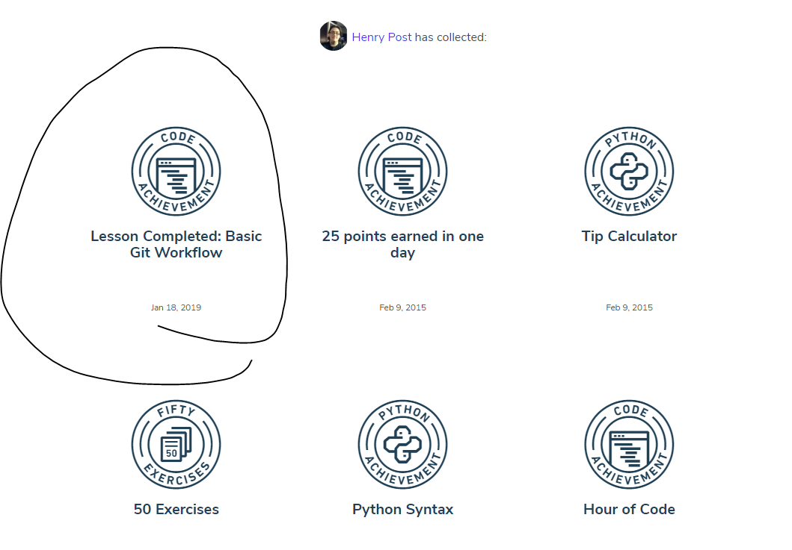

# Henry Post

 

## Where are you from?

I was born and raised in Chicago my whole life.

My mom, who was (probably) australian, grew up in Saudi Arabia, and my dad grew
up in the US.

## What is your IT interest/specialty?

Programming! Plain and simple, that's my favorite by far.

I like Python, Java, Kotlin, and C#.

I prefer programming backends, libraries, command-line tools, and algorithms.

I moderately enjoy creating GUIs. I like me some key shortcuts, though. My
philosophy is, "you shouldn't need a mouse to use my program".

I don't like programming web/mobile interfaces as much, but [I can and
have](http://henryfbp.me).

I also like to repair computers, phones, and I like building computers too.

I tutor privately on Wyzant and used to work for IIT's ARC.

## Something interesting about you?

I like to run, SCUBA dive (if I can), bake pies and other sweets, and play
Factorio/Minecraft/Super Smash Bros!

## Git tutorial

